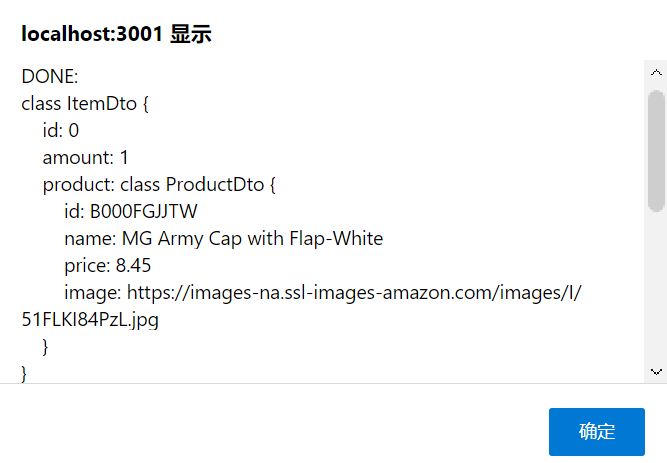
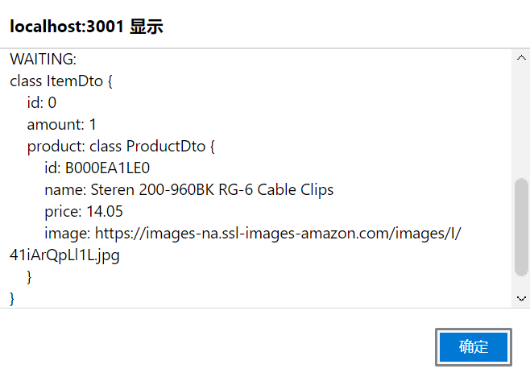

# aw10-final

Please develop a **fully functional** online purchase order system.

- It should have a superb collection of goods merchandises
- Customer can browse/search for merchandises, add selected one into his shopping cart and checkout to complete a transaction.
- User can get delivery status updates continuously.

The system should be of a **reactive architecture**, which means it should be 

-  Responsive: it should response to the user request timely.
-  Resilient: it should not be easily broken down.
-  Elastic: it should be flexible to scale out.
-  Message Driven: it should has loosely coupled components that communicates with each other asynchronously.

Please design tests/experiements to demostrate that your system fulfills such requirements as stated in [The Reactive Manifesto](https://www.reactivemanifesto.org)

**Submit your codes/documents/tests/experiements of your system.**

---

## 简介

后端采用微服务架构

图中的Counter Service的功能实际实现在Order Service中

使用的是AMAZON_FASHION商品数据集，由于`meta_AMAZON_FASHION.json`体积过大（184.30 MB），因此没有添加到git仓库中。使用spring-batch处理商品信息，存入mysql数据库。

使用openapi生成cart、product、order的接口

前端使用助教提供的，并做了一定程度的修改以增加新功能及匹配后端。由于我从未接触过前端框架，因此本次实验实际上很大一部分时间是用在前端的调试上面，包括但不仅限于：

- 框架基本理解
- （post请求引起的）options请求引发的cross-origin的问题
- 后端返回的不是一个JavaScript object（text）时的对接

初始界面：

功能：

浏览、添加、购买商品，取消（清空）购物车

目前category和page虽然能起到筛选作用，但其实是随机的

查询订单状态（可以简陋，但不能没有）

## 运行

1. 启动pos-batch，等待job完成后停止。

2. docker-compose部署RabbitMQ

    > ./start-server.bat

3. 依次启动所有微服务

    | service       | 启动优先级 |
    | ------------- | ---------- |
    | pos-discovery | 1          |
    | pos-carts     | 2          |
    | pos-products  | 2          |
    | pos-delivery  | 2          |
    | pos-order     | 3          |
    | pos-gateway   | 4          |

4. 启动前端

    `cd pos-frontend && npm start`

---

## Reactive

### Responsive

系统需要能够快速响应请求。

提前处理商品数据，并且使用cache

### Resilient

系统需要有良好的鲁棒性。

主要体现在Order Service对Cart Service的请求中使用了circuit breaker来做熔断。

### Elastic

系统需要能够灵活地扩展。

微服务架构对扩展提供了基本的便利性

商品数据是存在mysql这样的关系数据库中，而不是存在某个服务进程数据中。product service可以方便地使用docker启动多个实例，实现水平向扩展。在product service的配置中，端口并不是写死的（实际上只有gateway是固定端口），在gateway中也实现了load balance访问

### Message Driven

使用openapi生成reactive的接口（using the Spring WebFlux stack）

Order Service接收购物车信息生成订单，通过RabbitMQ将订单作为消息传递到 Delivery Service